# A Comprehensive Guide to Salesforce Deployment Tools: Choosing the Right Solution for Your Organization

## Introduction

In today's fast-paced business environment, organizations leveraging Salesforce need robust, reliable deployment strategies to maintain competitive advantage. The traditional waterfall approach to Salesforce development and deployment has given way to modern DevOps practices that emphasize continuous integration, continuous deployment (CI/CD), and branch-based development workflows.

This article explores the landscape of Salesforce deployment tools, examining both native Salesforce options and third-party solutions. Whether you're a small team just starting your DevOps journey or an enterprise organization looking to optimize your deployment pipeline, understanding the strengths and limitations of each tool is crucial for making an informed decision.

## Understanding Branch-Based Deployments and DevOps in Salesforce

### What is Branch-Based Development?

Branch-based development is a cornerstone of modern DevOps practices. In this approach, developers create isolated branches in a version control system (typically Git) to work on features, bug fixes, or experiments without affecting the main codebase. Once changes are tested and approved, they're merged back into the main branch and deployed to production.

### Basic Git Branching Concept

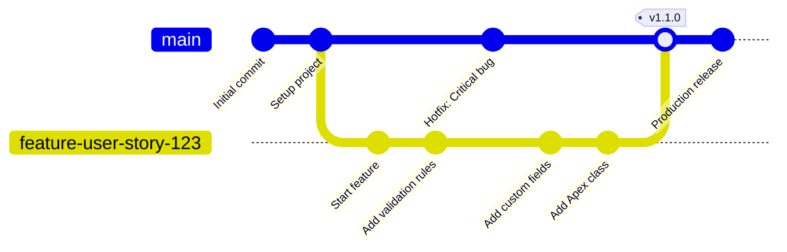

**Key Concepts:**
- **Main Branch**: The stable, production-ready code
- **Feature Branch**: Isolated development work for specific features or user stories
- **Merge**: Combining feature branch changes back into main branch
- **Hotfix**: Quick fixes applied directly to main for urgent production issues

### Feature Branch Workflow in Salesforce Context

Here's how a typical feature development and deployment cycle works:

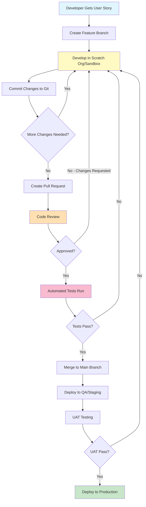

### Complete DevOps Pipeline with Environments

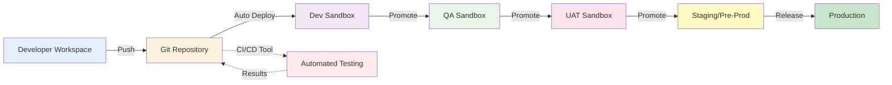

### GitFlow Strategy for Salesforce

Many organizations adopt GitFlow, a branching strategy that defines specific branch types and their purposes:

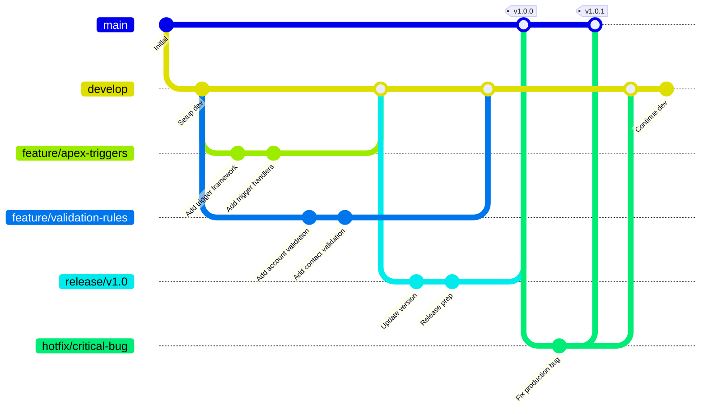

**GitFlow Branch Types:**
- **main/master**: Production-ready code only
- **develop**: Integration branch for features
- **feature/***: Individual feature development
- **release/***: Release preparation and testing
- **hotfix/***: Emergency production fixes

### Trunk-Based Development (Simplified Alternative)

A simpler alternative to GitFlow, popular with high-velocity teams:

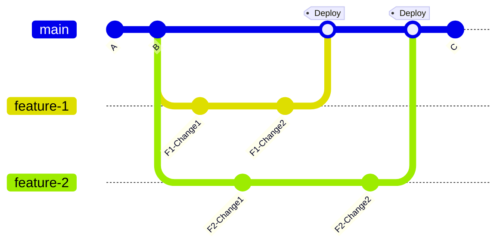

**Trunk-Based Characteristics:**
- Short-lived feature branches (1-3 days maximum)
- Frequent merges to main
- Feature flags for incomplete features
- Rapid deployment cadence

### Pull Request and Merge Process

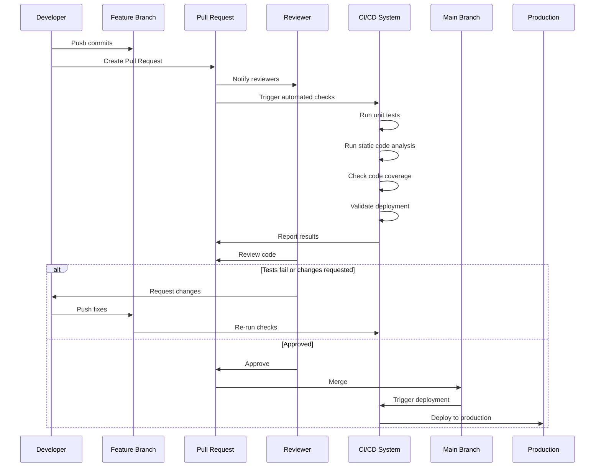

### The DevOps Transformation in Salesforce

Traditional Salesforce development often involved direct modifications in sandboxes with manual deployment processes. This approach presented several challenges:

- **Lack of version control**: Changes weren't always tracked systematically
- **Merge conflicts**: Multiple developers working simultaneously caused conflicts
- **Limited rollback capabilities**: Reverting problematic changes was difficult
- **Poor visibility**: Tracking who changed what and when was challenging
- **Manual processes**: Deployments were time-consuming and error-prone

Modern DevOps tools address these challenges by introducing:

- **Source control integration**: All metadata is version-controlled
- **Automated testing**: Changes are validated before deployment
- **CI/CD pipelines**: Automated build and deployment processes
- **Environment management**: Consistent promotion paths across environments
- **Audit trails**: Complete visibility into all changes
- **Collaboration features**: Code reviews, merge requests, and approval processes

### Traditional vs. Modern Deployment Comparison

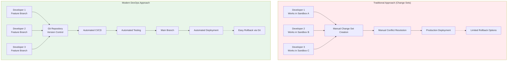

### Environment Promotion Strategy

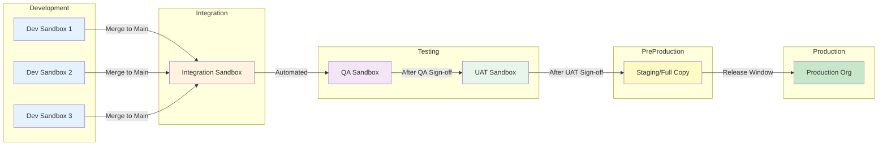

## Salesforce Native Deployment Options

Before exploring third-party solutions, it's important to understand what Salesforce offers out of the box.

### 1. Change Sets

**Overview**: Change Sets are Salesforce's native deployment tool, allowing you to package metadata components and send them from one Salesforce org to another.

#### Pros:
- **Zero additional cost**: Included with all Salesforce licenses
- **User-friendly interface**: Accessible through Setup menu, no technical expertise required
- **Direct deployment**: No external tools or systems needed
- **Salesforce support**: Fully supported by Salesforce customer service
- **Quick setup**: Can be used immediately without configuration
- **Ideal for simple deployments**: Works well for small, straightforward changes

#### Cons:
- **No version control integration**: Changes aren't tracked in Git or similar systems
- **Manual and error-prone**: Developers must manually select all components and dependencies
- **Limited rollback capability**: Reverting changes requires creating another change set
- **No merge conflict resolution**: Difficult to handle concurrent development
- **Deployment connections required**: Must establish trust relationships between orgs
- **Directional limitation**: Can only deploy between connected orgs (e.g., sandbox to production)
- **Missing dependencies**: Easy to miss related components, causing deployment failures
- **No automated testing integration**: Must manually run tests
- **Poor for complex projects**: Becomes unwieldy with large-scale changes
- **Limited audit trail**: Tracking historical changes is difficult

**Best For**: Small teams with simple deployment needs, quick hotfixes, or organizations just starting with Salesforce.

#### Change Sets Deployment Flow

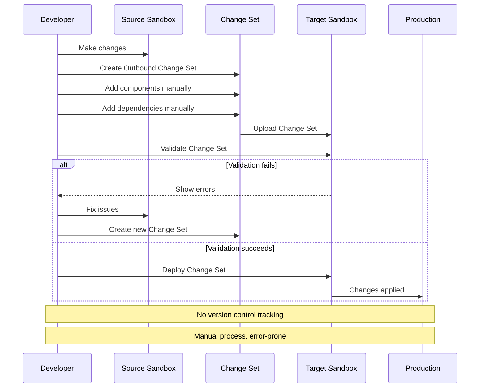

### 2. Salesforce CLI and Metadata API

**Overview**: The Salesforce CLI (Command Line Interface) and Metadata API provide programmatic access to deploy and retrieve metadata.

#### Pros:
- **Free and native**: Included with Salesforce platform
- **Automation potential**: Can be scripted for automated deployments
- **Version control friendly**: Works well with Git and other VCS
- **Flexible**: Can be integrated into custom CI/CD pipelines
- **Full metadata coverage**: Access to all deployable metadata types
- **Source-driven development**: Supports modern development workflows
- **Package development**: Essential for building managed packages

#### Cons:
- **Technical expertise required**: Requires command-line knowledge and scripting skills
- **Manual pipeline creation**: Must build your own CI/CD infrastructure
- **No GUI**: Command-line only, not user-friendly for non-developers
- **Configuration complexity**: Requires substantial setup and maintenance
- **Limited deployment orchestration**: No built-in workflow management
- **Minimal reporting**: Requires custom solutions for deployment visibility
- **No dedicated support**: Community-based support only

**Best For**: Technical teams with DevOps expertise who want to build custom deployment pipelines, or organizations already using tools like Jenkins, GitHub Actions, or GitLab CI.

#### Salesforce CLI CI/CD Pipeline Example

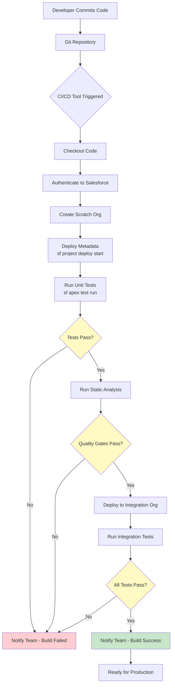

### 3. Salesforce DevOps Center

**Overview**: DevOps Center is Salesforce's newest native offering (announced in 2022), designed to bring modern DevOps practices to Salesforce without requiring third-party tools.

#### Pros:
- **Native Salesforce solution**: Integrated directly into Salesforce platform
- **Git integration**: Built-in version control with support for GitHub and GitLab
- **Visual pipeline management**: User-friendly interface for managing deployments
- **Branch-based development**: Supports modern DevOps workflows
- **No additional licensing**: Included with certain Salesforce editions
- **Change comparison**: Visual diff tools to review changes
- **Deployment monitoring**: Track deployment status and history
- **Salesforce support**: Backed by Salesforce customer service

#### Cons:
- **Relatively new**: Still maturing with limited feature set compared to established tools
- **Edition requirements**: Not available on all Salesforce editions
- **Limited automation**: Fewer automation capabilities than mature third-party tools
- **Basic reporting**: Analytics and insights are limited
- **Git provider limitations**: Currently supports only select Git providers
- **Learning curve**: Still requires understanding of Git and DevOps concepts
- **Feature gaps**: Missing some advanced features available in third-party tools
- **Scalability concerns**: May not meet needs of very large, complex organizations

**Best For**: Organizations wanting to adopt DevOps practices without third-party tools, mid-sized teams looking for a balance between functionality and simplicity.

#### DevOps Center Workflow

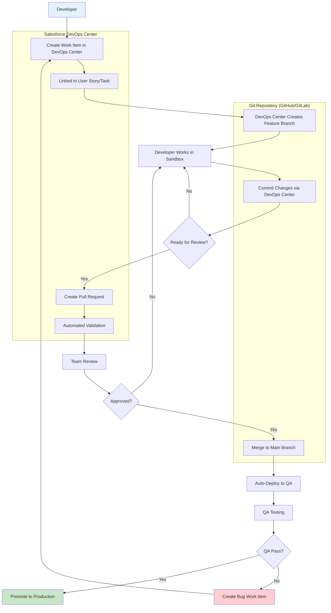

### Copado Architecture and Workflow

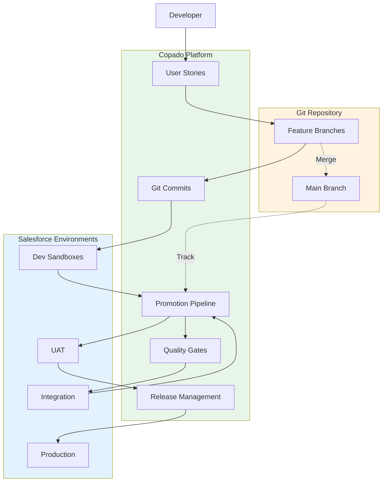

## Third-Party Deployment Solutions

### 1. Copado

**Overview**: Copado is a comprehensive DevOps platform built natively on Salesforce, offering end-to-end release management capabilities. It's one of the most widely adopted third-party solutions in the Salesforce ecosystem.

#### Pros:
- **Native Salesforce app**: Built on Salesforce platform, familiar interface for Salesforce users
- **Comprehensive feature set**: Includes version control, CI/CD, testing, and release management
- **Git-based workflows**: Full support for branch-based development
- **Robust automation**: Extensive automation capabilities for builds, tests, and deployments
- **Multi-cloud support**: Works with Sales Cloud, Service Cloud, Marketing Cloud, and more
- **Quality gates**: Built-in quality checks and compliance features
- **Advanced testing**: Integrated test automation and quality management
- **Rollback capabilities**: Easy rollback to previous versions
- **Extensive integrations**: Connects with Jira, Jenkins, Selenium, and many other tools
- **User management**: Granular permissions and role-based access
- **Compliance features**: Audit trails, compliance checks, and governance tools
- **Snapshot capabilities**: Environment comparison and backup features
- **Strong community**: Active user community and extensive documentation
- **Training and certification**: Comprehensive training programs available
- **Enterprise-grade**: Proven scalability for large organizations

#### Cons:
- **High cost**: Premium pricing that may be prohibitive for small organizations
- **Complexity**: Feature-rich platform with steep learning curve
- **Setup time**: Initial configuration and onboarding can be lengthy
- **Salesforce license requirement**: Each Copado user needs a Salesforce license
- **Over-engineering for simple needs**: May be overkill for small teams with basic requirements
- **Dependency on vendor**: Reliance on Copado's roadmap and support
- **Performance**: Can be slower for very large metadata deployments
- **Customization limits**: While flexible, some customizations may require Copado support

**Best For**: Enterprise organizations with complex deployment needs, teams requiring comprehensive compliance and governance features, organizations with multiple Salesforce clouds and environments.

#### Copado Deployment Pipeline with Quality Gates

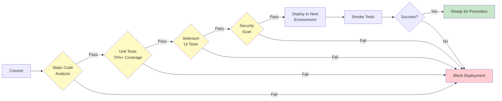

### 2. Flosum

**Overview**: Flosum is a cloud-based release management and DevOps platform for Salesforce, also built natively on the Salesforce platform. It provides end-to-end application lifecycle management.

#### Pros:
- **Native Salesforce solution**: Built on Salesforce, integrates seamlessly
- **User-friendly interface**: Intuitive UI designed for Salesforce administrators and developers
- **Git integration**: Built-in Git repository or connect to external repos
- **Comprehensive ALM**: Covers entire application lifecycle from development to deployment
- **Version control**: Robust metadata versioning and tracking
- **Merge management**: Advanced merge conflict resolution tools
- **Automated deployments**: Scheduling and automation capabilities
- **Backup and recovery**: Point-in-time recovery and disaster recovery features
- **Compliance tracking**: Audit trails and compliance reporting
- **Lower cost than Copado**: Generally more affordable pricing model
- **Quick deployment**: Relatively fast setup and implementation
- **Static code analysis**: Built-in code quality checks
- **Data migration tools**: Includes data deployment capabilities
- **Multi-org support**: Manage multiple Salesforce orgs from single platform

#### Cons:
- **Smaller market presence**: Less widely adopted than Copado
- **Limited community**: Smaller user community compared to competitors
- **Feature maturity**: Some features less mature than established competitors
- **Integration ecosystem**: Fewer third-party integrations compared to Copado
- **Documentation gaps**: Documentation may not be as comprehensive
- **Scalability questions**: Less proven in very large enterprise scenarios
- **Support response**: Support quality can vary
- **Learning resources**: Fewer training materials and certifications available
- **Customization limitations**: Some advanced customizations may be challenging

**Best For**: Mid-sized organizations looking for comprehensive DevOps features at a more accessible price point, teams that prioritize ease of use and quick implementation.

#### Flosum Release Management Flow

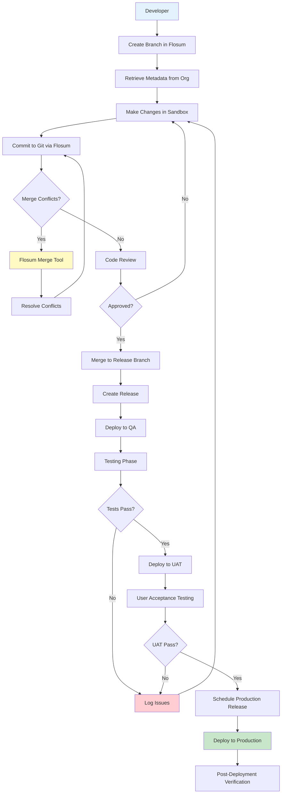

### 3. Gearset

**Overview**: Gearset is a web-based DevOps platform specifically designed for Salesforce, known for its powerful comparison engine and developer-friendly features.

#### Pros:
- **Powerful comparison engine**: Industry-leading metadata comparison and analysis
- **Not Salesforce-based**: Independent web application, doesn't require Salesforce licenses for users
- **Fast deployments**: Optimized deployment speed
- **Excellent CI/CD**: Robust continuous integration pipelines
- **Git flexibility**: Works with GitHub, GitLab, Bitbucket, Azure DevOps, and others
- **Problem analyzer**: Intelligent identification of deployment issues
- **Automated testing**: Integrated test automation
- **Comprehensive monitoring**: Deployment tracking and notifications
- **Backup capabilities**: Automated org backups
- **Team collaboration**: Code reviews and approval workflows
- **Detailed reporting**: Analytics and deployment insights
- **User experience**: Modern, intuitive interface
- **Regular updates**: Frequent feature releases and improvements
- **Support quality**: Known for responsive customer support

#### Cons:
- **External dependency**: Requires trusting third-party with Salesforce credentials
- **Cost**: Premium pricing similar to other enterprise tools
- **Internet dependency**: Requires stable internet connection
- **No native Salesforce integration**: Not built on Salesforce platform
- **Learning curve**: Requires training for effective use
- **Licensing model**: Per-user pricing can add up for large teams

**Best For**: Development-focused teams, organizations with complex Git workflows, teams that want powerful comparison and analysis tools.

#### Gearset Comparison and Deployment Process

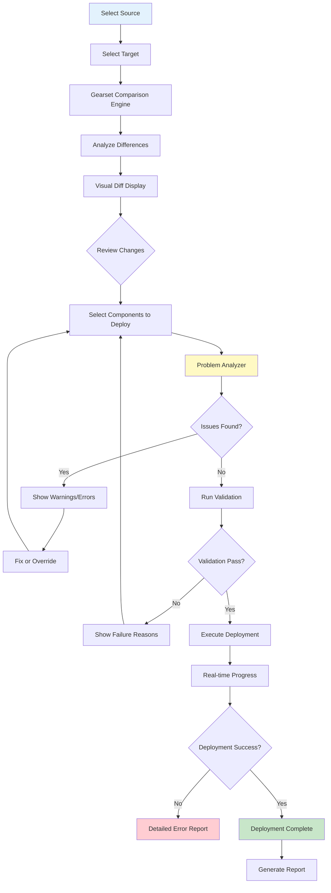

### Gearset CI/CD Pipeline with Multiple Git Providers

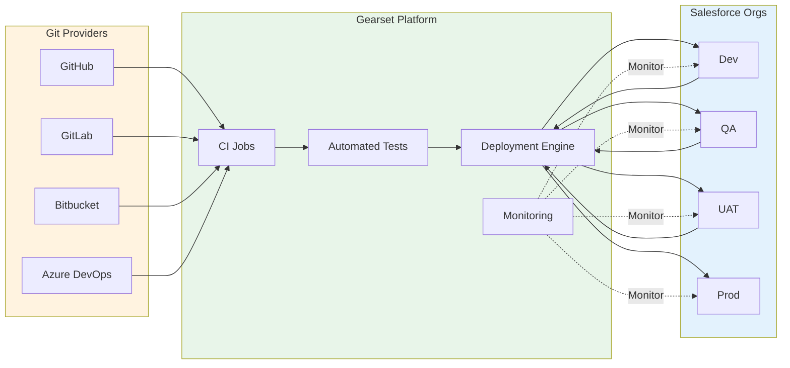

### 4. AutoRABIT

**Overview**: AutoRABIT provides release management, data management, and DevSecOps solutions for Salesforce with strong emphasis on security and compliance.

#### Pros:
- **Security focus**: Strong emphasis on code security and vulnerability scanning
- **Data migration**: Excellent data deployment and migration capabilities
- **Compliance features**: Robust compliance and governance tools
- **Version control agnostic**: Works with various version control systems
- **Static code analysis**: Comprehensive code quality scanning
- **Rollback capabilities**: Reliable rollback and restore features
- **Metadata backup**: Comprehensive backup solutions
- **Test automation**: Integrated testing capabilities
- **ELT capabilities**: Data loader and transformation tools

#### Cons:
- **User interface**: Interface can feel dated compared to competitors
- **Complexity**: Feature-rich but can be overwhelming
- **Cost**: Premium pricing
- **Learning curve**: Requires significant training
- **Setup complexity**: Initial configuration can be involved

**Best For**: Organizations with strong security and compliance requirements, teams needing robust data migration capabilities, regulated industries.

#### AutoRABIT DevSecOps Pipeline

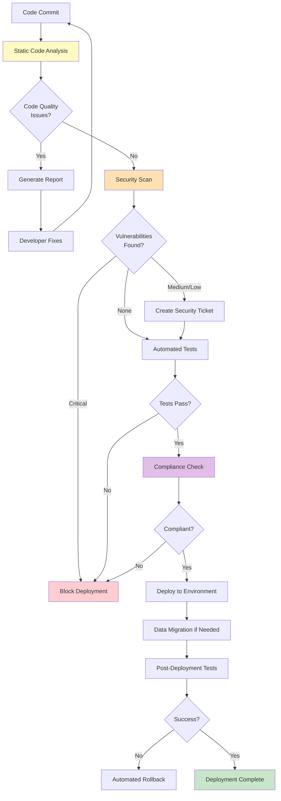

## Making the Right Choice

### Decision Framework

When selecting a Salesforce deployment tool, consider these factors:

#### Decision Tree for Tool Selection

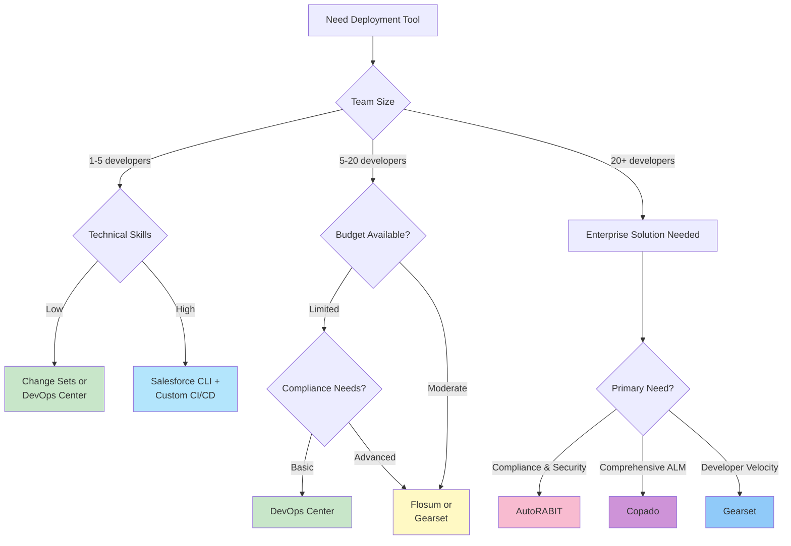

### Tool Comparison Matrix

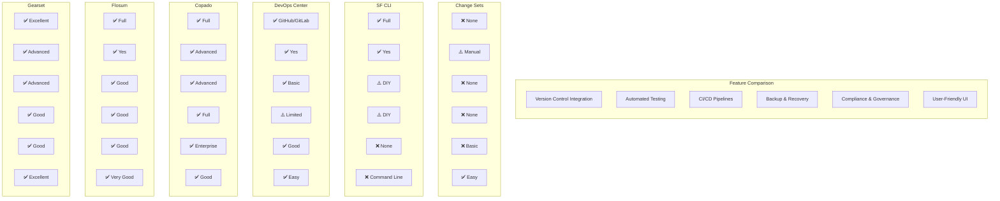

### Cost vs Capability Matrix

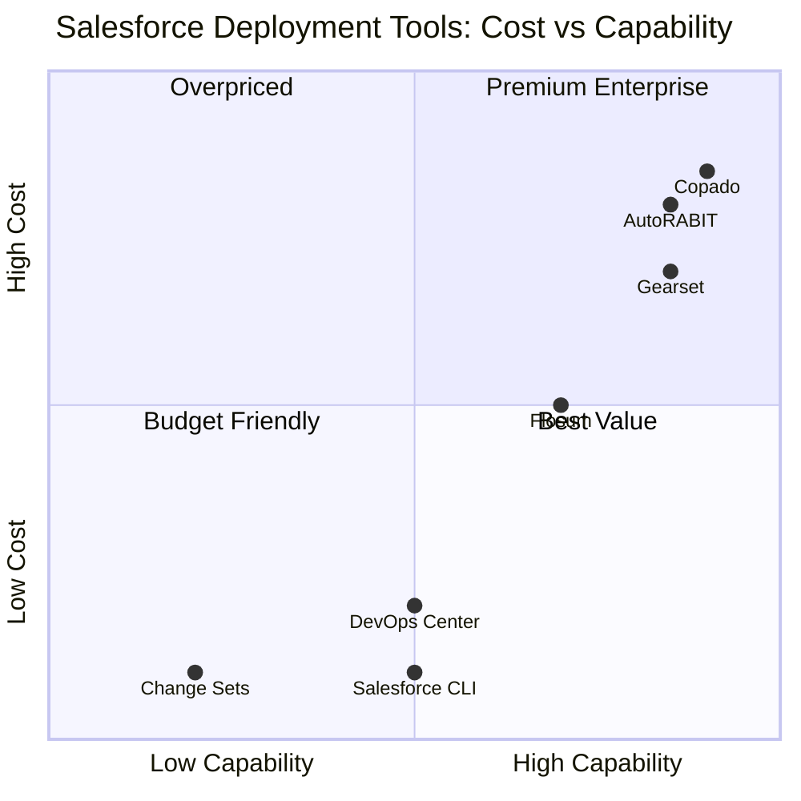

1. **Team Size and Technical Expertise**
   - Small, non-technical teams: Change Sets or DevOps Center
   - Technical teams: Salesforce CLI with custom CI/CD
   - Mixed technical abilities: Flosum or Copado

2. **Budget**
   - Limited budget: Native Salesforce options
   - Moderate budget: Flosum
   - Enterprise budget: Copado, Gearset, or AutoRABIT

3. **Deployment Complexity**
   - Simple deployments: Change Sets
   - Moderate complexity: DevOps Center, Flosum
   - High complexity: Copado, Gearset, AutoRABIT

4. **Compliance Requirements**
   - Basic: Native options
   - Moderate: Flosum, Gearset
   - Strict: Copado, AutoRABIT

5. **Scale**
   - Small org (1-5 developers): Change Sets, DevOps Center
   - Medium org (5-20 developers): DevOps Center, Flosum, Gearset
   - Large org (20+ developers): Copado, AutoRABIT, Gearset

### Migration Path Recommendation

Many organizations follow this progression:

```mermaid
journey
    title DevOps Maturity Journey for Salesforce Teams
    section Starting Out
      Manual Changes: 2: Team
      Change Sets: 3: Team
      No Version Control: 1: Team
    section Growing Team
      Implement Git: 5: Team
      DevOps Center: 6: Team
      Basic Automation: 5: Team
    section Scaling Up
      Third-Party Tool: 7: Team
      Advanced CI/CD: 8: Team
      Full Automation: 8: Team
    section Mature DevOps
      Enterprise Platform: 9: Team
      DevSecOps: 9: Team
      Continuous Delivery: 10: Team
```

### Maturity Model Progression

```mermaid
graph LR
    L1[Level 1:<br/>Manual] --> L2[Level 2:<br/>Basic Automation]
    L2 --> L3[Level 3:<br/>CI/CD]
    L3 --> L4[Level 4:<br/>Advanced DevOps]
    L4 --> L5[Level 5:<br/>Continuous Delivery]
    
    L1 -.->|Tools| T1[Change Sets]
    L2 -.->|Tools| T2[DevOps Center<br/>SF CLI]
    L3 -.->|Tools| T3[Flosum<br/>Basic Gearset]
    L4 -.->|Tools| T4[Copado<br/>Advanced Gearset]
    L5 -.->|Tools| T5[Full Copado<br/>AutoRABIT]
    
    style L1 fill:#ffcdd2
    style L2 fill:#fff9c4
    style L3 fill:#c5e1a5
    style L4 fill:#a5d6a7
    style L5 fill:#81c784
```

### Example Migration Timeline

```mermaid
gantt
    title Sample DevOps Tool Migration Journey (2-Year Plan)
    dateFormat YYYY-MM
    section Phase 1
    Change Sets Only           :done, 2024-01, 2024-06
    Introduce Git              :done, 2024-04, 2024-07
    section Phase 2
    Train Team on Git          :active, 2024-07, 2024-09
    Deploy DevOps Center       :active, 2024-08, 2024-10
    Parallel with Change Sets  :2024-10, 2025-01
    section Phase 3
    Full DevOps Center Adoption:2025-01, 2025-04
    Evaluate Third-Party Tools :2025-03, 2025-05
    section Phase 4
    Select Enterprise Tool     :2025-05, 2025-06
    Implement Flosum/Copado   :2025-06, 2025-09
    Advanced Automation        :2025-09, 2026-01
```

1. **Start**: Change Sets for simple needs
2. **Grow**: DevOps Center or Salesforce CLI as team expands
3. **Scale**: Third-party solution (Flosum, Copado, Gearset) as complexity increases
4. **Enterprise**: Comprehensive platform (Copado, AutoRABIT) for mature DevOps practices

## Conclusion

The Salesforce deployment landscape offers solutions for every organization size, technical capability, and budget. Native Salesforce options like Change Sets and DevOps Center provide accessible entry points for teams beginning their DevOps journey, while third-party platforms like Copado, Flosum, and Gearset offer enterprise-grade capabilities for organizations with complex requirements.

### Summary Visualization: Tool Selection at a Glance

```mermaid
mindmap
  root((Salesforce<br/>Deployment<br/>Tools))
    Native
      Change Sets
        ✅ Free & Simple
        ❌ No Version Control
        Best for: Beginners
      SF CLI
        ✅ Free & Flexible
        ❌ Requires Expertise
        Best for: Technical Teams
      DevOps Center
        ✅ Modern DevOps
        ❌ Limited Features
        Best for: Mid-size Teams
    Third Party
      Copado
        ✅ Comprehensive
        ❌ Expensive
        Best for: Enterprise
      Flosum
        ✅ User Friendly
        ❌ Smaller Community
        Best for: Mid-Market
      Gearset
        ✅ Powerful Comparison
        ❌ Premium Price
        Best for: Developers
      AutoRABIT
        ✅ Security Focus
        ❌ Complex UI
        Best for: Compliance
```

### Key Success Factors Beyond Tools

```mermaid
graph TB
    A[Successful Salesforce DevOps] --> B[Right Tool]
    A --> C[Team Training]
    A --> D[Clear Processes]
    A --> E[Cultural Change]
    A --> F[Continuous Improvement]
    
    B --> B1[Matches Team Size]
    B --> B2[Fits Budget]
    B --> B3[Scales with Growth]
    
    C --> C1[Git Training]
    C --> C2[Tool Certification]
    C --> C3[Best Practices]
    
    D --> D1[Branching Strategy]
    D --> D2[Code Review Process]
    D --> D3[Release Management]
    
    E --> E1[DevOps Mindset]
    E --> E2[Collaboration]
    E --> E3[Quality Focus]
    
    F --> F1[Regular Retrospectives]
    F --> F2[Metrics Tracking]
    F --> F3[Process Optimization]
    
    style A fill:#81c784
    style B fill:#64b5f6
    style C fill:#ffb74d
    style D fill:#ba68c8
    style E fill:#4dd0e1
    style F fill:#ff8a65
```

The key is to honestly assess your organization's current state and future needs. Starting simple and scaling up as requirements grow is often more successful than implementing an over-engineered solution prematurely. Whichever tool you choose, embracing DevOps practices—version control, automated testing, continuous integration—will significantly improve your Salesforce development and deployment processes.

Remember, the tool is only part of the solution. Success requires not just technology, but also cultural change, process improvements, and ongoing commitment to best practices. Invest time in training your team, establishing clear processes, and fostering a culture of collaboration and continuous improvement.

---

*This article was last updated: January 2026*

## Additional Resources

- [Salesforce DevOps Center Documentation](https://help.salesforce.com/s/articleView?id=sf.devops_center_overview.htm)
- [Salesforce CLI Documentation](https://developer.salesforce.com/docs/atlas.en-us.sfdx_cli_reference.meta/sfdx_cli_reference/)
- [Copado Official Website](https://www.copado.com/)
- [Flosum Official Website](https://www.flosum.com/)
- [Gearset Official Website](https://gearset.com/)
- [AutoRABIT Official Website](https://www.autorabit.com/)
